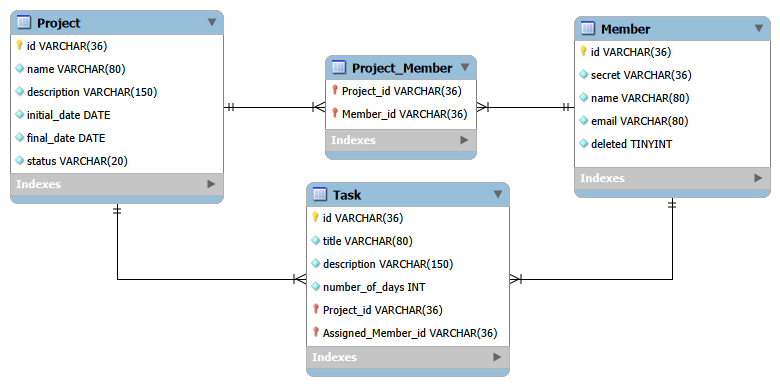

## Domain Model

A ideia do projeto é utilizar modelo de domínio simples e focado em resolver o problema de gerenciamento de projetos, membros e tarefas.

### Entidades

- **Project**  
  Representa um projeto no sistema. Armazena informações básicas como nome, descrição, data de início, data de término e o status atual do projeto. O mesmo pode conter várias tarefas e pode ter vários membros associados

- **Member**  
  Representa um usuário do sistema que pode participar de um ou mais projetos. Contém dados como nome, e-mail e um identificador de autenticação, além de um campo para controle de exclusão lógica

- **Task**  
  Representa uma tarefa vinculada a um projeto. Cada tarefa possui um título, descrição, uma estimativa de duração em dias e um status. Ela sempre pertence a um único projeto e é atribuída a um único membro responsável

### Relacionamentos

- Projetos e membros possuem uma relação many-to-many, permitindo que um projeto tenha vários membros e que um membro participe de diferentes projetos;
- Um projeto pode possuir várias tarefas, enquanto cada tarefa pertence a apenas um projeto;
- E por fim, cada tarefa é atribuída a um único membro, mas um membro pode ser responsável por várias tarefas.

### Enums

- **ProjectStatus**  
  Define o estado de um projeto, ex: `PENDING`, `IN_PROGRESS` ou `FINISHED`.

- **TaskStatus**  
  Define o estado de uma tarefa, ex: `PENDING`, `IN_PROGRESS` ou `FINISHED`.

### Diagrama

O diagrama de classes abaixo representa o modelo de domínio e reflete fielmente as entidades utilizadas na aplicação.

## Database Model

Este diagrama mostra como os dados são organizados no banco. Representa as tabelas, as pks, as fks e como as informações se relacionam.

O modelo segue o que foi definido no domínio: projetos podem ter várias tarefas, tarefas pertencem a um único projeto e cada tarefa é atribuída a um membro.... A relação entre projetos e membros é many-to-many, resolvida por uma tabela auxiliar.

